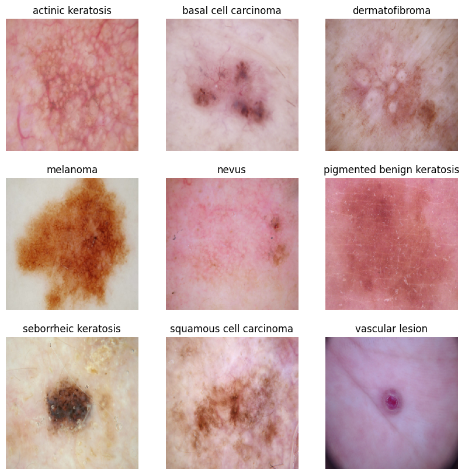

# Melanoma Prediction
This assignment is to build a **multiclass classification model** using a custom **convolutional neural network** in TensorFlow. 

 

- We need to build a CNN based model which can accurately detect melanoma. 
- Melanoma is a type of cancer that can be deadly if not detected early and accounts for 75% of skin cancer deaths. 
- A solution that can evaluate images and alert dermatologists about the presence of melanoma has the potential to reduce a lot of manual effort needed in diagnosis.

## Table of Contents
* [General Info](#general-information)
* [Project pipeline](#project-pipeline)
* [Technologies Used](#technologies-used)
* [Acknowledgements](#acknowledgements)
* [Contact](#contact)
* [License](#license)

## General Information
This project uses a dataset that can be downloaded from [here](https://drive.google.com/file/d/1xLfSQUGDl8ezNNbUkpuHOYvSpTyxVhCs/view?usp=sharing)

The dataset consists of 2357 images of malignant and benign oncological diseases, which were formed from the International Skin Imaging Collaboration (ISIC). All images were sorted according to the classification taken with ISIC, and all subsets were divided into the same number of images, with the exception of melanomas and moles, whose images are slightly dominant.

The data set contains the following diseases (a sample of each image corresponding to various classes of dataset):

## Project pipeline
- Analyse Data
    - Data Reading/Data Understanding → Defining the path for train and test images 
    - Dataset Creation→ Create train & validation dataset from the train directory with a batch size of 32. 
    - Dataset visualisation → visualize one instance of all the nine classes present in the dataset 
- First Model Building & training : 
    - Create a CNN model, which can accurately detect 9 classes present in the dataset. 
    - Choose an appropriate optimiser and loss function for model training
    - Train the model for ~20 epochs
    - Model analysis to check evidence of model overfit or underfit.
- Choosing ata augmentation strategy to resolve underfitting/overfitting 
    - Model Building & training on the augmented data :
    - Create a CNN model
    - Choose an appropriate optimiser and loss function for model training
    - Train the model for ~20 epochs
    - Evaluate model again
- Class distribution: Examine the current class distribution in the training dataset 
- Handling class imbalances: Rectify class imbalances present in the training dataset with Augmentor library.
    - Model Building & training on the rectified class imbalance data :
        - Create a CNN model
        - Choose an appropriate optimiser and loss function for model training
    - Train the model for ~30 epochs
- Conclusion
    - Trained final model is a good fit

## Technologies Used
- python - v3.11.5
- numpy
- pandas
- Tensorflow version - version 2.16.2
- VS Code
- Jupyter Notebook

## Contact
Created by [rathnagiri](https://github.com/rathnagiri/) - feel free to contact me!

## License
This project is open source and available under the Apache license 2.0